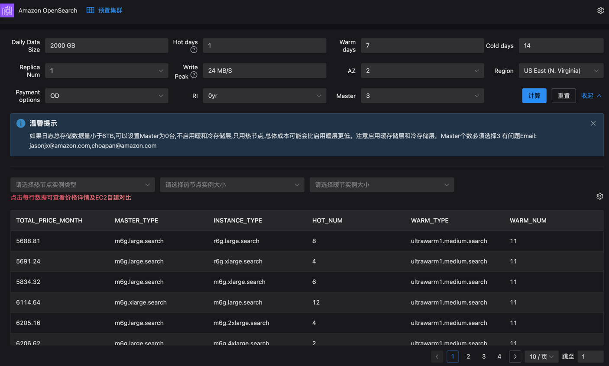

### 访问地址
http://aos-sizing-alb-1600186889.us-east-1.elb.amazonaws.com:6688/
### 界面


### aos-api 
* 开启启动
```shell
vi /etc/systemd/system/aos-api.service 

[Unit]
Description=aos api
After=network.target

[Service]
ExecStart=/opt/app/aos/aos_venv/bin/python /opt/app/aos/aos-sizing-api/app.py
WorkingDirectory=/opt/app/aos/aos-sizing-api/
Restart=always
User=root
Environment="PATH=/opt/app/aos/aos_venv/bin:/usr/local/sbin:/usr/local/bin:/usr/sbin:/usr/bin:/sbin:/bin"

[Install]
WantedBy=multi-user.target
```

```shell
sudo systemctl daemon-reload
sudo systemctl enable aos-api.service
sudo systemctl start aos-api.service
sudo systemctl status aos-api.service
journalctl -u aos-api.service
```

```shell
curl 'http://18.142.177.244:9989/provisioned/es_ec2_sizing' \
  -H 'Accept: application/json, text/plain, */*' \
  -H 'Accept-Language: zh-CN,zh;q=0.9,en-CN;q=0.8,en;q=0.7' \
  -H 'Connection: keep-alive' \
  -H 'Content-Type: application/json;charset=UTF-8' \
  -H 'Origin: http://18.142.177.244:9990' \
  -H 'Referer: http://18.142.177.244:9990/' \
  -H 'User-Agent: Mozilla/5.0 (Macintosh; Intel Mac OS X 10_15_7) AppleWebKit/537.36 (KHTML, like Gecko) Chrome/134.0.0.0 Safari/537.36' \
  --data-raw '{"warmDays":7,"coldDays":14,"writePeak":24,"paymentOptions":"OD","dailyDataSize":2000,"hotDays":1,"replicaNum":"1","AZ":2,"region":"US East (N. Virginia)","RI":"0yr","master":3,"table_filter":0,"filterData":"--","reqEC2Instance":"r7g.medium.search"}' \
  --insecure ;
  
curl 'http://localhost:9989/provisioned/es_ec2_sizing' \
  -H 'Accept: application/json, text/plain, */*' \
  -H 'Accept-Language: zh-CN,zh;q=0.9,en-CN;q=0.8,en;q=0.7' \
  -H 'Connection: keep-alive' \
  -H 'Content-Type: application/json;charset=UTF-8' \
  -H 'Origin: http://localhost:9990' \
  -H 'Referer: http://localhost:9990/' \
  -H 'User-Agent: Mozilla/5.0 (Macintosh; Intel Mac OS X 10_15_7) AppleWebKit/537.36 (KHTML, like Gecko) Chrome/134.0.0.0 Safari/537.36' \
  --data-raw '{"warmDays":7,"coldDays":14,"writePeak":24,"paymentOptions":"OD","dailyDataSize":2000,"hotDays":1,"replicaNum":"1","AZ":2,"region":"US East (N. Virginia)","RI":"0yr","master":3,"table_filter":0,"filterData":"--","reqEC2Instance":"r7g.medium.search"}' \
  --insecure ;
  
  
curl 'http://localhost:9989/provisioned/log_analytics_sizing' \
  -H 'Accept: application/json, text/plain, */*' \
  -H 'Accept-Language: zh-CN,zh;q=0.9,en-CN;q=0.8,en;q=0.7' \
  -H 'Connection: keep-alive' \
  -H 'Content-Type: application/json;charset=UTF-8' \
  -H 'Origin: http://localhost:9990' \
  -H 'Referer: http://localhost:9990/' \
  -H 'User-Agent: Mozilla/5.0 (Macintosh; Intel Mac OS X 10_15_7) AppleWebKit/537.36 (KHTML, like Gecko) Chrome/134.0.0.0 Safari/537.36' \
  --data-raw '{"writePeak":2370,"paymentOptions":"OD","dailyDataSize":200000,"hotDays":14,"warmDays":0,"coldDays":0,"replicaNum":0,"AZ":2,"region":"US East (N. Virginia)","RI":"0yr","master":3,"filterData":"","reqEC2Instance":"or1.2xlarge.search","name":"","address":"","date":null,"pageSize":1000,"page":1}' \
  --insecure ;


```